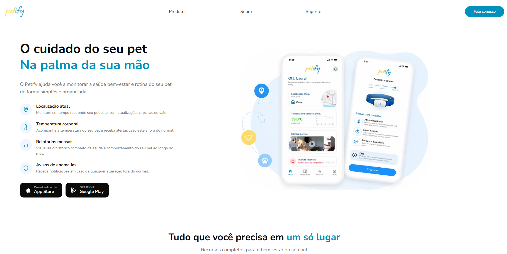
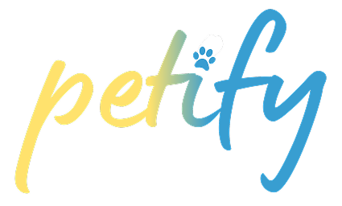

<div align="center">

<p align="center">
  
</p>
<p align="center">

</p>

<h1>O cuidado do seu pet, na palma da sua mão.</h1>
<h3>Site oficial para adquirir a coleira ou pingente inteligente Petify, um dispositivo que monitora a saúde, localização e rotina do seu pet em tempo real.</h3>


 Acesse o site: https://petify-website.vercel.app/

</div>

---

##  Sobre o projeto

O Petify é a plataforma de vendas da nossa coleira inteligente para pets.
Através de sensores embutidos, a coleira coleta dados em tempo real e envia
tudo direto para o app do tutor, permitindo acompanhar a saúde e a rotina do
animal de qualquer lugar.

Este repositório contém o site institucional e de vendas,
construído em Next.js, onde o tutor conhece o produto, os recursos e realiza
a compra da coleira.

##  O que a coleira monitora

| | Recurso | Descrição |
|---|---|---|
 **Monitora sinais vitais** | Recebe alertas imediatos em caso de qualquer alteração fora do normal. |
 **Localização em tempo real** | Acompanhe cada passo do seu pet, onde quer que ele esteja. |
 **Monitora atividades** | Acompanha o nível de atividade do pet ao longo do dia. |
 **Monitoramento de sono** | Entenda a qualidade de sono e descanso do seu pet. |
 **Resistente à água** | Perfeita para todos os momentos do dia, sem preocupação. |
 **Alertas inteligentes** | Notificações de saúde, fugas e comportamentos incomuns. |


##  Estrutura do projeto


```
-Rodando localmente

Pré-requisito: [Node.js](https://nodejs.org/) 18.17 ou superior.

bash
-clone o repositório
git clone https://github.com/seu-usuario/petify.git
cd petify

-instale as dependências
npm install

-rode em modo desenvolvimento
npm run dev


Abra [http://localhost:3000](http://localhost:3000) no navegador.
```

##  Licença

Distribuído sob a licença MIT. Veja `LICENSE` para mais detalhes.

---

<div align="center">
Feito por: Agno J.
  Bruno G.
  Gustavo M.
  Heloísa M.
  Laura L.
  
</div>
